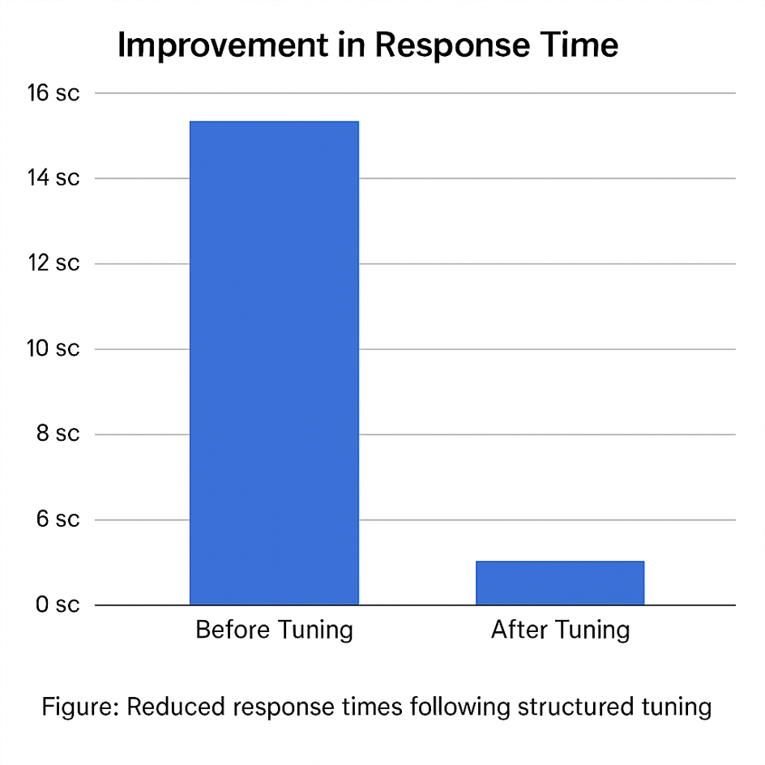

## From Hotfixes to Structure: Order Endpoint Tuning as Architectural Inquiry

### 1. Introduction

In 2022, we undertook what we thought was a pragmatic but deeply structural tuning of the `/orders` endpoint. The changes—targeted fetch controls, decoupled access paths, reduced statement volume—resulted in an immediate and measurable improvement. Response times dropped from over 14 seconds to under 2; active cursors per request fell from more than 55,000 to under 2,500.

At the time, we made a prediction: **this tuning would likely hold—for about two years**. And for almost two years, it did. Even when database timeouts occurred in production, they were rare and traceable to infrastructure issues like NFS dismounts or node failures, not query load.

But around six months ago—almost on schedule—those early warning signs returned. The system, once again, began to exhibit pressure that couldn’t be blamed on the network. That’s what brought us back to the architecture—and prompted this series.

> **Disclaimer**: The `/orders` endpoint referenced in this article is a placeholder and does not correspond to any real-world API path.
> This tuning case originates from a domain-specific enterprise system rather than an internet-scale service.
> We are well aware that typical web-scale APIs would often rely on flat data models or document stores like MongoDB in such scenarios.
> This example is chosen solely for clarity and to expose structural insights applicable across architectures.

This article revisits a seemingly routine performance tuning effort—optimizing the `/orders` endpoint under high load. But beyond Hibernate annotations or fetch strategy tweaks, it became an invitation to examine the underlying assumptions of how APIs access data, how fetch strategies are structured, and how architectural primitives (or their absence) shape performance outcomes.

> These early improvements, though promising on paper, quickly hit architectural ceilings. In particular, `NamedEntityGraph` triggered Hibernate's `HHH000104` warning — causing pagination to break silently, leading to excessive memory consumption and eventually application-level overloads. As we looked ahead, it became clear that conventional tuning — even when well-configured — wouldn’t suffice. The next wave of changes would require a more deliberate decoupling of hydration and navigation: a **2-step fetch strategy**.

### 2. Historical Metrics: Cursor vs. Response Time


*Figure: Decline in active database cursors after hotfixes, tuning, and structural improvements.*



*Figure: Reduced response times following structured tuning.*

These charts compare single-call test performance before and after tuning. The first shows a dramatic drop in active database cursors. The second illustrates a corresponding improvement in response time—from over **14 seconds** to under **2 seconds**—achieved by reducing statement volume and avoiding deep traversal, even without concurrency.

In production, the unoptimized version frequently triggered **database timeouts** under concurrent load — a clear sign that performance issues weren’t just theoretical but operationally critical.

Before any formal tuning began, the system was already exhibiting signs of extreme stress — **at peak load, the database reported over 55,000 active cursors.**

This wasn’t a warning sign; it was a fire alarm. It meant the persistence layer had no guardrails, and the cost of a single API call was catastrophically high under concurrency.

The issue long predated our formal intervention. A large, imperative code block in `CacheOperations.java` attempted to manually pre-load associated entities by deeply traversing and `Hibernate.initialize(...)` each nested relationship.

This code—clearly disliked even by its original author—reflected a desperate workaround in absence of structured access shaping mechanisms. It blurred boundaries between business logic, persistence logic, and data lifecycle assumptions.

```java
// Simplified from CacheOperations.java
for (OrderEntity order : orders) {
  for (CustomerEntity c : order.getCustomerEntities()) {
    for (AccountEntity acc : c.getAccountEntities()) {
      for (RegionEntity region : acc.getRegionEntities()) {
        Hibernate.initialize(region);
      }
    }
  }
  for (Tag t : order.getTags()) {
    Hibernate.initialize(t);
  }
}
```

This approach made three things obvious:

* Hibernate offered no extensible access path abstraction.
* Fetch behavior was baked into static annotations.
* The system lacked runtime-level observability or control of query shape.

### 3. Initial Structured Tuning with JPA

We began by formally replacing imperative eager-loading with declarative annotations.

#### Steps:

1. Add `@NamedEntityGraph` to `OrderEntity`
2. Apply it in the Spring Data repository
3. Introduce `@Transactional(readOnly = true)` at controller layer to preserve session
4. Use `@Subgraph` and `@BatchSize` to tune nested collections

#### Outcome:

* Initial improvement
* But revealed a deeper problem: `HHH000104`

### 4. The Breakage: HHH000104

Baeldung and Appsloveworld both note the consequence of using eager collection fetches with pagination:

> `HHH000104: firstResult / maxResults specified with collection fetch; applying in memory!`

This meant Hibernate had to materialize *all* rows before slicing them in memory—a direct path to memory pressure and performance collapse.

### 5. The Turning Point: Two-Step Fetching

Instead of tuning annotations further, we redesigned the access path:

* Step 1: Query only IDs with pagination and filters
* Step 2: Fetch entity graph using `WHERE id IN (...)`
* Re-sort results post-hydration if needed

This removed the conflict between eager collection fetch and pagination.


*Figure: Join-based cursor reduction strategies can backfire, especially under pagination or deep relationships. The pie chart highlights how inflated join results—many of them redundant—can dominate the returned dataset, despite fewer executed queries.*

### 6. When Fixes Break

One of our later tuning attempts — reducing the cursor count to around 1,100 by expanding `@Subgraph` joins — surprisingly worsened performance.

The reason was simple: an over-ambitious join plan created expensive Cartesian explosions and redundant work in the database. Fewer cursors don’t always mean faster queries — especially when joins explode.

This irony predicted what would later become fact: two years on, with data volume increased, the same system began to fail again. And developers were still armed with the same limited tools: batch sizes, fetch joins, entity graphs, persistence context tricks — and eventually, the decisive addition of **two-step fetch** in version 2.45.1.

JPA, like many frameworks of its kind, became a kingdom of patches.

But did this ever prompt its designers to rethink the architectural model behind these layers of indirection, statefulness, and fetch semantics?

Clearly not.

The patch parade continues—because the underlying abstraction was never structurally revisited.

Our tuning? A reluctant tribute to that patchwork kingdom.

If it left behind any feeling, it wasn’t pride. It was unease — and the urge to ask better questions.


*Figure: From over 55,000 cursors per call to under 1,200 after staged tuning. Still, the system was not out of danger.*

### 7. Persistent Risk: 1,200 Cursors

Even after the 2.45.1 release — combining `@NamedEntityGraph`, `@Subgraph`, `@BatchSize`, `@Transactional`, and two-step fetch — the database still reported around **1,200 active cursors** under peak load. Better than 55k, but still far from ideal.

This raised critical questions:

* Why so many cursors?
* Are ORM fetch semantics leaking into resource control?
* Can we tune Hibernate enough—or must we step outside its model?

### 8. Systemic Reflection: ORM is Not Enough

We concluded that tuning was merely alleviating symptoms. The real problem is architectural:

* No extensible access path planning mechanism
* No runtime observability of fetch strategies
* No dynamic shaping of hydration behavior based on query context

Most ORM frameworks, Hibernate included, simply don’t support:

* Runtime data shape negotiation
* Intent-driven query structuring
* Separation of identity resolution from data hydration


*Figure: Production crash patterns resurface almost two years after initial tuning, validating earlier predictions. System metrics during crash periods reveal the classic signs of query collapse: load spikes, stalled threads, and connection exhaustion. These weren’t anomalies—they were forecast.*

### 9. Looking Forward

The deployment of the two-step access path in 2.45.1 marked a dramatic turning point. For nearly two years, Zabbix metrics confirmed exceptional system stability: minimal slow queries, steady resource usage, and—perhaps most importantly—no more of those cryptic “database is gone” or connection timeout events. It was a period of quiet reliability.

This wasn’t just luck. The prediction—that the solution would hold for two years—was grounded in a structural insight: **as long as data volume grew at a linear rate, cursor pressure would remain bounded**. And for a time, it did.

But time doesn’t stand still. Roughly two and a half years later, symptoms began to resurface. Most of the outages observed in the past six months stemmed from infrastructure—not application—failures: intermittent network disruptions (local and regional), NFS dismounts on virtual machines, and other low-level instabilities.

Still, the reappearance of database stress—however externally triggered—reminded us that the underlying architecture had never fully evolved. The tuning had worked, but only within a bounded regime. **Once that regime shifted, cracks reappeared.**

And that brings us to the real question: **Should developers even be trapped in this level of cursor math, session awareness, and hydration complexity in the first place?**

The fact that such deep tuning was needed at all is not a failure of execution—it is a symptom of architectural limitation.

This article doesn’t close the loop; it opens a new one. One that asks: **How do we design access layers that are structured, observable, adaptable—and fast, without manual babysitting?**

### Epilogue: When the Patches Run Out

The system is breaking again.
We know the ritual: tweak the batch size, rewire the EntityGraph, add another `@BatchSize`, disable that join, flush the context, try again.
But the patches are fraying.
And beneath them, the architecture hasn't changed.
We once called it optimization.
We now call it superstition.
This isn't engineering anymore.
**It's incense burning.**

### 10. Appendix: Conventional JPA Techniques (Not Endorsed, But Documented)

These may help in some cases, but don’t address the architectural root:

* `JOIN FETCH` with limit caveats
* `@BatchSize`
* Projection interfaces in Spring Data
* DTO-based hydrators
* Native queries with projections

> Our position: these techniques are symptomatic, not structural. We document them, but advocate for architectural rewiring instead.

### References

For those seeking further reference on these JPA techniques, we include a few notable resources:

* Baeldung: [NamedEntityGraph](https://www.baeldung.com/spring-data-jpa-named-entity-graphs)
* Appsloveworld: [Pagination with Lazy Load](https://www.appsloveworld.com/springboot/100/123/using-spring-data-jpa-entitygraph-with-lazy-load-mode-for-namedattributenode-fiel)
* Internal: p6spy logs, profiling dashboards
* MatrixOne (legacy system) – OID-first access model (not MatrixOrigin)


*Figure: How patch-based caching strategies mask root issues but ultimately reintroduce reliability risk.*

### Final Note

These techniques remain widely used and can help in narrow situations. But they do not address the structural root of data access challenges. In this series, we chose to document them for completeness—while making clear that real solutions require rethinking how systems fetch, shape, and structure data.

Notably, we omitted second-level caching and `@Cacheable`—not because they’re irrelevant, but because they often hide inefficiencies rather than address them. Caching is not access shaping; it’s access postponement.

Structure isn’t just a performance tool — it’s how systems make promises they can keep.

This may not be the last word on performance, but it was a structural shift — not another patch. The 2-step fetch was not just a tactic. It was the moment we stopped reacting and started designing.

---

*If anyone at Dassault R\&D feels my interpretation doesn't fully align with MatrixOne's original design… please take note: this might actually be the blueprint for your next-generation engine. 😉*

*This series is not affiliated with Dassault Systèmes. It’s simply a technical deep dive by someone who believes MatrixOne’s architecture still has a lot to teach us.*
