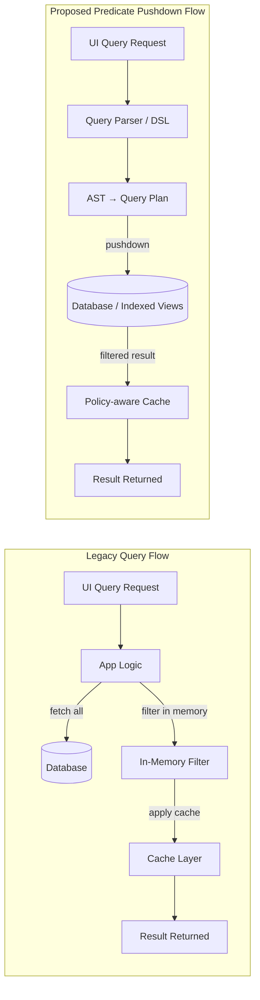

# When Low-Hanging Fruit Turns Rotten — A Background and Technical Narrative

## 1. System environment

- **Domain:** Enterprise-developed product information system used across multiple divisions.
- **Backend stack:** Java + Spring Boot with REST APIs, using **MariaDB** as the main relational store.
- **Data scale:** Mid-sized (two primary tables in the tens of thousands to a few hundred thousand rows) — not “big data,” but enough to punish inefficient access patterns.
- **Usage pattern:** Highly dynamic filtering and authorization per division or site — many ad-hoc query combinations driven by UI filters.

The system was originally designed for small datasets but grew rapidly as new divisions joined. Query logic stayed in the app layer while data complexity expanded at the database layer.

---

## 2. The origin of the problem

At the heart of the issue was a **filtering mechanism implemented entirely in memory**:

- The API would pull a large dataset from the DB, then apply Boolean filters, joins, and permission checks in Java.
- There was **no predicate pushdown**; the database could not optimize because it was only asked for raw, unfiltered data.
- Permissions were validated *after* fetching — meaning all rows, even irrelevant ones, consumed I/O and RAM.

When usage expanded, a single query could trigger **millions of DB hits** and cause OOM errors in the app tier. Developers responded with patches and caches, but those only masked the underlying problem. Despite mid-sized tables, JPA N+1, missing predicate pushdown, and no in-memory indexing inflated round-trips — turning ordinary volumes into hundreds of thousands, even millions, of individual database calls query cascades.

---

## 3. Attempts at quick fixes

Several teams tried to improve performance without rethinking the architecture:

- Adding ad-hoc caches on the application side.
- Creating partial Boolean filters (without parentheses or operator precedence).
- Hardcoding certain divisions or roles to bypass complex logic.

Each of these was a **“low-hanging fruit”** — easy to implement, short-term visible, but long-term damaging.  The overall structure remained a *fetch-all + filter-in-memory* pipeline.

---

## 4. Diagram: Old vs New Architecture

**Comparison**

| Aspect                 | Old Design                        | New Design                                 |
| ---------------------- | --------------------------------- | ------------------------------------------ |
| Filter Execution       | In memory after fetching all data | Predicate pushdown to DB layer             |
| Boolean Logic          | Limited (no nesting/precedence)   | Full AST-based logical model               |
| Permission Enforcement | App layer (post-query)            | Embedded in query plan (policy predicates) |
| Performance            | 1M+ DB hits, frequent OOMs        | Selective queries, reduced I/O & memory    |
| Maintainability        | Patch-driven, fragile             | Model-driven, testable, reusable           |
| Cache Strategy         | Blind object cache                | Policy-aware + TTL-based cache             |

---

## 5. Why “low-hanging fruit” failed here

- **Local fixes vs. global debt:** Each patch focused on one symptom (a path, a field, a branch) while the real cause—*unbounded in-memory filtering without a real query model*—stayed intact.
- **I/O amplification:** Fetch-then-filter multiplies DB hits and network bytes; caching multiplies stale data windows.
- **Unverifiable semantics:** Without precedence/nesting, business logic gets “re-encoded” in code branches—hard to reason about, harder to test.
- **Security as an afterthought:** Permissions not pushed down force late filtering, risking leaks and wasting work.

---

## 6. The redesigned architecture

### Core improvements

- Implemented **policy-aware predicate pushdown** so filters and permissions execute within the database.
- Introduced a **query DSL** capable of `AND/OR/NOT`, nested parentheses, range operations, and precedence.
- Built an **AST-based query planner** translating logical expressions into SQL-level constraints.
- Integrated **policy-aware caching**, ensuring post-policy results with TTL and predictable invalidation.

### Key benefits

- **DB hits reduced** by more than 10× for common query shapes.
- **No more OOMs**, as filtering is delegated to the data layer.
- **Consistent results**, thanks to unified query logic instead of duplicated app-side filters.
- **Simplified debugging**, since all predicates are traceable in the plan output.

---

## 7. Migration plan (no big bang)

- **Phase 0 — Freeze + Observe:** Freeze new “quick fixes”. Add telemetry for query shapes, result sizes, memory, and DB hits.
- **Phase 1 — Introduce the model:** Define the query schema (JSON/DSL) with full boolean semantics + parentheses. Keep old path; **shadow-execute** new path on a small cohort, compare results.
- **Phase 2 — Pushdown mapping:** Map each predicate to storage-level filters (views/indexes/RLS). Add projections and limits; prove DB hits ↓ and RAM usage ↓.
- **Phase 3 — Policy integration:** Encode permissions as predicates in the plan; remove duplicate app-side filters.
- **Phase 4 — Decommission:** Turn off legacy branches; delete cache hacks tied to pre-pushdown flow.

---

## 8. Lessons Learned / Cultural Reflection

### 1. Organizational short-termism

Teams often confuse *speed* with *progress*. Under pressure to deliver visible results, they favor “quick fixes” that create the illusion of progress while silently increasing systemic debt. Leadership tends to reward immediate closure of tickets, not the invisible effort of refactoring or system redesign.

### 2. The false comfort of “working code”

Once a system “runs,” there’s a strong bias against revisiting core logic, even if the cost of running it is skyrocketing. Teams mistake stability for health — but technical debt behaves like interest, not principal; it compounds invisibly until it consumes all agility.

### 3. Fear of complexity

A design that introduces formal models (like predicate pushdown or a DSL) is often labeled as “too complex,” even when it actually *reduces* total complexity by organizing chaos. The aversion to such change stems from a lack of shared understanding of architectural value and a fear of owning long-term consequences.

### 4. Skill asymmetry and cognitive bias

In teams with uneven technical depth, decision-making naturally drifts toward the lowest common denominator. Simpler, ad-hoc fixes feel more accessible; deep redesigns require a shared conceptual language that’s often missing. Over time, this produces a culture of patching rather than planning.

### 5. Leadership’s role in shifting incentives

Architectural renewal doesn’t happen spontaneously — it requires leaders to *protect long-term work from short-term noise*. Changing the reward structure (celebrating systemic improvements, not just ticket throughput) is the only way to escape the low-hanging-fruit trap.

### 6. Conclusion

The million-hit query is not just a performance bug — it’s a mirror reflecting how teams perceive effort, ownership, and time. True progress begins when an organization realizes that **maintainable systems grow from disciplined choices, not quick wins**.

---

## 9. Summary for external readers

This narrative combines the **technical**, **organizational**, and **cultural** dimensions of the “low-hanging fruit” problem.\
It describes how an enterprise product information system evolved from memory-bound filtering to a pushdown-based query model, and what the journey revealed about software culture: that fixing quickly is easy, but fixing correctly is rare.

