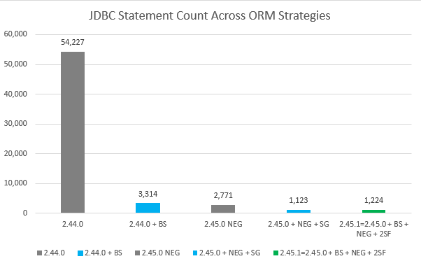

## Order Endpoint: Anatomy of an ORM Collapse

*A Tuning Chronicle from Faith to Fatigue*

*Or: How @EntityGraph Failed, and What Saved Us for Two Years*

---

### 1. Introduction: Not a Theory — This Happened

> Note: The "order" endpoint is a stand-in for a classic enterprise scenario — inspired by real-world cases from e-commerce platforms, ERP systems, and logistics backends. The structure and insights here are applicable far beyond this specific naming.

This is the story of how a production endpoint — `/orders` — went through a full spectrum of ORM tuning strategies, from naive fetch joins to two-step fetch decomposition. It’s not a whitepaper. It’s what actually happened.

It started with a single call that triggered **55,000 database cursors**, consistently breaching 15s response time. The issue wasn’t infrastructure. It was design — or rather, a lack thereof.

---

### 2. Baseline: A Slow Death by Lazy Load

Even before 2.44.0, the endpoint had already seen one celebrated fix: **introducing second-level caching**.

- The effect was immediate — load appeared to improve, and dashboards calmed.
- But it masked a deeper issue: **the cached entities still hydrated full object graphs**.
- And when they did, cursor pressure exploded — invisibly at first, then systemically.

That cache victory eventually led directly into the hydration trap inside `CacheOperations` — and opened the door to the N+1 implosion that followed.

There’s a moment worth remembering. When I discussed a similar performance issue with a seasoned developer friend — not directly involved with this endpoint — he offered a solution without hesitation: “Just use cache.”

It wasn’t cynicism. It was belief. In many Java teams, **caching is architecture**. If you’re seasoned, you know it by instinct — cache it, and it’s fixed. Side effects? Don’t worry about them.

That mindset, as comforting as it was, helped pave the road to a collapse that caching could never solve.

At v2.44.0, the endpoint loaded multiple deeply-linked entities using **default lazy-fetching**.

- Result: N+1 query explosion
- Symptoms: High cursor count, GC churn, thread stalls
- No `@EntityGraph`, no `join fetch`, no batch size hints

The code worked. But it wasn’t fast — or sustainable.

---

### 3. Attempt 1: The EntityGraph Era

At v2.45.0, the team introduced `@NamedEntityGraph` to explicitly fetch major relations.

- Gains: Primary joins resolved in fewer queries
- Gaps: Coverage of nested relationships was static and rigid
- Side effects: Coupling between graph depth and fetch cost increased

Manual `Hibernate.initialize()` calls were no longer needed — and cursor count dropped to around 5,000.

However, this came at a cost. Hibernate emitted warning `HHH000104`, indicating that fetch joins disabled pagination (`firstResult/maxResults`). Instead of streaming paginated results directly from the database, Hibernate loaded the full result set into memory and paginated in application space.

This shift moved pressure from the database to the application — and eventually brought down both.

---

### 4. Attempt 2: Subgraph Overload

Already present in v2.45.0, `@Subgraph` was aggressively expanded to fetch deeper relationships.

- Goal: Reduce the number of SQL calls by broadening the fetch graph
- Result: Pagination broke (warning: fetch join disables `firstResult/maxResults`)
- Join explosion: Redundant Cartesian products inflated result sets

Ironically, while active cursor count dropped further, **response time spiked dramatically**.

Performance worsened, and the illusion of "fewer queries equals faster system" was shattered.

---

### 5. Attempt 3: The BatchSize Duct Tape

The team fell back to `@BatchSize(size = 20)` on major associations.

- Helped flatten certain access patterns
- Delayed hydration until explicitly accessed
- Reduced connection churn and cursor allocation pressure

It worked — but only as a **runtime behavior tweak**, not a structural change.

---

### 6. Breakthrough: Two-Step Fetch (v2.45.1)

Version 2.45.1 wasn’t a clean departure — it was a convergence. After 2.45.0 introduced `@NamedEntityGraph`, the team explored parallel options: adding `@BatchSize` to 2.44.0, expanding `@SubGraph` for nested depth, and experimenting with batching strategies. Each path offered partial gains — and revealed new tradeoffs.

Version 2.45.1 synthesized the best of all: `NamedEntityGraph` for primary structure, `SubGraph` for depth, `@Transactional` for scoped execution, `@BatchSize` for stability, and most crucially, a **Two-Step Fetch** strategy to regain control from Hibernate’s fetch-join internals.

This wasn’t just a fix. It was a **shift in mental model** — and a farewell to the illusion of declarative fetch magic.

Yet the outcome was hard to deny:
- **Response time dropped** from nearly 15 seconds to just **1.9 seconds**.
- **Active cursor count collapsed** from over 54,000 to around **1,200**.

The gains were dramatic, even if the cursor count still felt high.

A lingering question remained: *Should that number have been in the single digits?*

Drawing from past experience with SQL traces in other platforms — like MQL — we had seen hundreds of cursors in complex queries. But many of those weren't true executions. Some hit local B-tree indexes. Others resolved dictionary lookups or metadata, often from cache.

By comparison, ORM frameworks often forced every access into a real roundtrip. And so even a seemingly good result left an uneasy aftertaste.

Still — given where we started — the outcome bordered on miraculous.

---

📌 **Visual Summary: ORM Tuning Outcomes**  
*From Fixes to Fatigue — Measuring the Illusion of Progress*

**1. Response Time (ms) Across ORM Strategies**  
*Not every drop in queries leads to better performance.*  

**2. JDBC Statement Count Across ORM Strategies**  
*More dramatic on paper than in real systems — beware of misleading victories.*  

These results clarified an uncomfortable truth: **not all optimizations are equal**, and sometimes, cutting too much introduces new bottlenecks — like the case of `SubGraph` reducing statements but increasing latency.

---

### 7. Relapse: When Patches Turn to Panic

In retrospect, each of the three releases — 2.44.0, 2.45.0, and 2.45.1 — felt like a victory.

In 2.44.0, we thought we had a baseline we could tame.  
In 2.45.0, we believed `@EntityGraph` had saved us.  
In 2.45.1, two-step fetch brought system metrics back to earth.

**Every fix felt like a triumph.**

Release notes glowed. Dashboards calmed. Applause happened.

Two and a half years passed. And then… the same system faltered.

This is where the tune changed — but the notes stayed the same.

The team reopened their old playbook:

- Shrink batch size?  
- Trim subgraphs?  
- Disable joins?

But this time, they weren’t tuning with confidence.

**They were tuning in fear.**

The options hadn’t changed. But their belief in the model had.

It felt like operating a haunted machine — every tweak might help or might unleash some hidden cascade.

> “We’d optimized every corner. But now, we feared the corners themselves.”

Patch fatigue had turned into architectural dread.

They knew there were more patches still on the table:

- `JOIN FETCH` with limit caveats
- `@BatchSize` rebinding and tuning
- Projection interfaces in Spring Data
- DTO-based hydrators
- Native queries with projections

And surely more to come. But in that moment, something deeper collapsed: **their faith in the model itself.**

It was like being trapped in an absurdist opera — where each act introduced a new annotation, and each annotation promised salvation, only to reroute the suffering.

Every patch began to feel like a theological exercise: not in performance, but in perseverance. As if tuning had become an art of denial, elegantly scripted in YAML and JavaDoc.

---

### 8. Conclusion: The Model Failed

The problem wasn’t the queries.

It was that **the abstraction provided by the ORM — of seamless object graphs and transparent fetch — had collapsed under its own complexity**.

They needed not another patch. They needed:

- Observable hydration plans
- Query shape introspection
- Programmable access layers

In other words: a system designed for **structure-first data access**, not runtime magic.

The order endpoint didn’t just expose a tuning flaw. It revealed an architectural cliff.

And they were lucky to have survived the first fall.

---

### Epilogue: Moving Past the Illusion

We can’t annotate our way out of architectural debt.

And yet, most teams still try — one patch, one `@Graph`, one batch at a time.

But performance isn’t just an emergent property of code. It’s a structural property of thought.

**Maybe it’s time to stop tuning — and start redesigning.**

Because sometimes, the real fix isn’t deeper fetch control.
It’s letting go of the illusion that the ORM ever knew what you needed in the first place.

---

📘 **Legend of Abbreviations (used in charts):**

- **NEG** — `@NamedEntityGraph`
- **SG** — `@SubGraph`
- **BS** — `@BatchSize`
- **2SF** — Two-Step Fetch
- **RT** — Response Time
- **JDBC Count** — Number of executed SQL statements (including those triggered by lazy loads or cascades)

🧠 *These tuning primitives were combined across different versions to assess trade-offs in latency and statement pressure.*

---

This piece is only the beginning.

In the next chapters of this series, we’ll dissect common ORM pitfalls, explore alternatives beyond the patch loop, and propose structure-driven approaches to data access — with real-world code, metrics, and migration paths.

Stay tuned.

